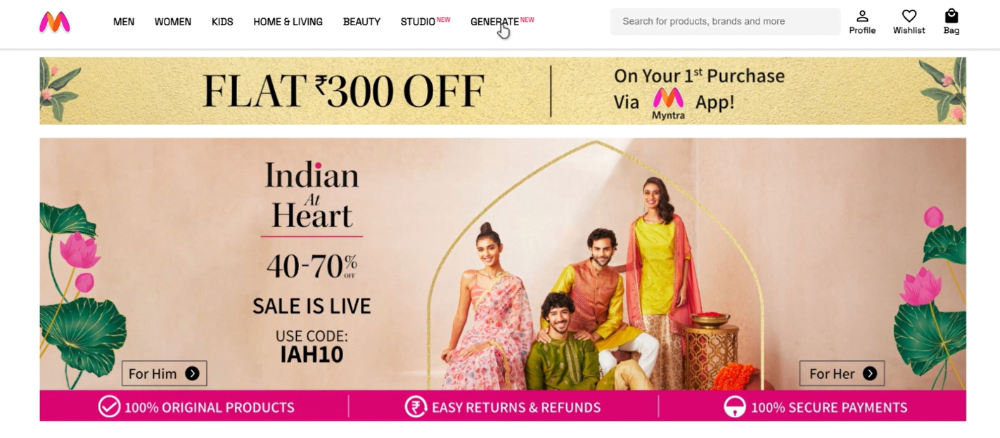

# MyntraHacker Ramp Hackathon: Build for Gen Z

## Overview

Welcome to our submission for the MyntraHacker Ramp Hackathon! We are Team Jade. Our project is focused on creating innovative solutions for Generation Z under the theme "Build for Gen Z." We are excited to present two solutions: Trend Generation and Trend Identification.

### Solution 1: Trend Generation

In this solution, we leverage advanced AI techniques to generate new fashion trends. Using the DeFooocus AI, we apply inpaint algorithms to create unique designs based on user inputs and existing fashion patterns.

#### Features:
- **AI-Powered Design Creation:** Generate trendy designs using AI.
- **User-Generated Designs:** Users can input their preferences and see them transformed into fashionable designs.
- **Inpaint Algorithm:** Enhances and modifies existing designs to create fresh trends.


### Solution 2: Trend Identification

Our second solution is a Chrome extension that helps users find products on Myntra by taking screenshots of items they like from other websites. If a similar outfit is not found on Myntra, users can save their search, helping Myntra understand current trends and user interests.

#### Features:
- **Screenshot-Based Search:** Users can take screenshots of outfits from any website to search for similar products on Myntra.
- **Save Unfound Searches:** If a similar outfit is not found, users can save their search to help Myntra identify trends.
- **User Insights:** Provides Myntra with data on what users are searching for across the web.

#### Demo Video
https://drive.google.com/file/d/1R4il9qgttnKw2wKCPkdOmb3DNLGQ_Ch_/view?usp=sharing

#### Screenshots
1. **Trend Generation:**
   
   
   


2. **Trend Identification Extension:**
   
   

## Getting Started

1. **Clone the repository:**
   ```sh
   git clone https://github.com/042Vidhi/Outfit_generation

   ```
   - Open the DeFooocus AI Colab notebook and run all cells.
   - Copy the URL provided by the notebook (this will be used in the script.js file).
   - Open `Website/MyntraUI/script.js` and replace the placeholder URL with the URL from the Colab notebook.
   - Navigate to the `website` folder.
   - open index.html then click on go live 


2. **Load the extension in Chrome:**
   - Open Chrome and go to `chrome://extensions/`.
   - Enable Developer mode.
   - Click "Load unpacked" and select the `build` folder from the project directory.


